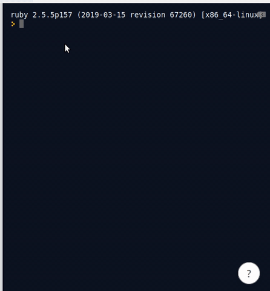
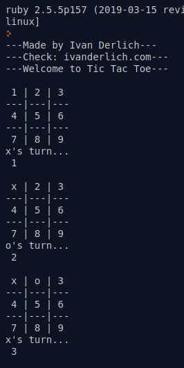
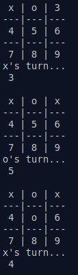
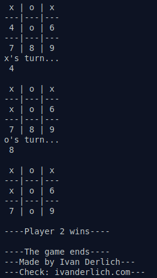

# Tictactoe

This is a Tic Tac Toe game that you can play in a Unix terminal.

https://en.wikipedia.org/wiki/Tic-tac-toe

## Demo
 
 
 

## Video

[Here](https://youtu.be/p8lbpEYSpKU)

## How to play it on the web

- Go to: https://repl.it/@IvanDerlich/Tic-Tac-Toe-1

- Click on the run button.

- Enjoy!

## How to play it on your computer

Install Ruby if you don't have it on your system:

https://www.ruby-lang.org/en/documentation/installation/

Download the repository:

  git clone git@github.com:IvanDerlich/Tictactoe.git

Move to the folder you just created:

  ruby main.rb

Enjoy!

## More Info

It was done as part of the Odin Project

https://www.theodinproject.com/courses/ruby-programming/lessons/oop

Wich is a part of the Microverse program I'm attending by the time of writting this code.

## Testing

The testing in this project is done as a part of another project

https://github.com/IvanDerlich/Rspec

## Contributors

[Ivan](https://github.com/IvanDerlich)
